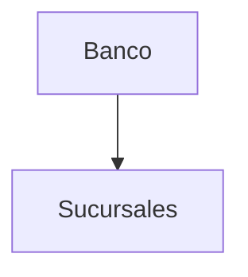
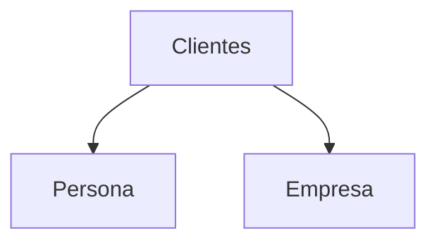
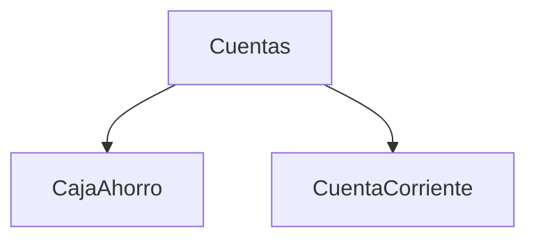
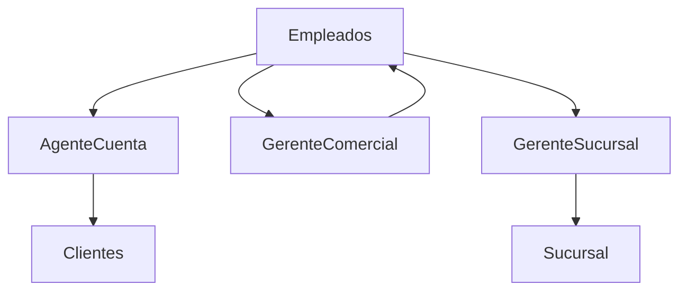

Objetos de un Sistema Bancario

```mermaid
graph TD;
    Banco-->Sucursales;
```

```mermaid
graph TD;
    Clientes-->Persona;
    Clientes-->Empresa;
```

```mermaid
graph TD;
    Cuentas-->CajaAhorro;
    Cuentas-->CuentaCorriente;
```

```mermaid
graph TD;
    Empleados-->AgenteCuenta-->Clientes;
    Empleados-->GerenteComercial-->Empleados;
    Empleados-->GerenteSucursal-->Sucursal;
```