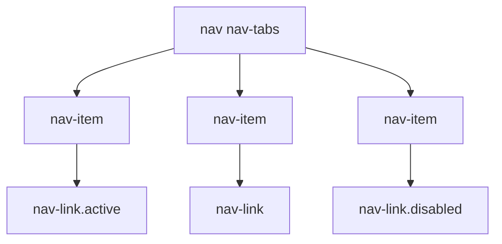
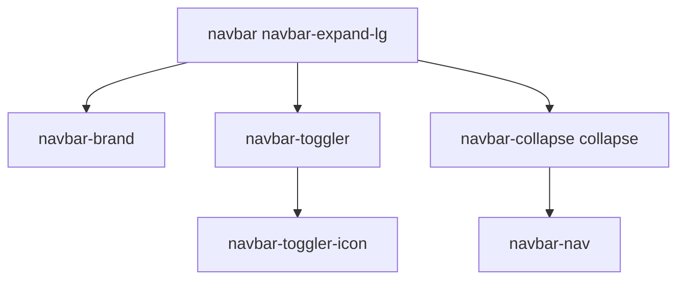

# Navegación

Bootstrap ofrece componentes de navegación robustos y flexibles para construir desde simples listas de enlaces hasta complejas barras de navegación responsivas.

## Menu

El componente `.nav` es la base para la mayoría de las navegaciones. Puede presentarse de varias formas:

* __Base__: Una lista de enlaces simple.
* __Tabs (`.nav-tabs`)__: Crea una navegación con pestañas.
* __Pills (`.nav-pills`)__: Crea una navegación con botones tipo "píldora".



```html
<ul class="nav nav-tabs">
  <li class="nav-item">
    <a class="nav-link active" aria-current="page" href="#">Activo</a>
  </li>
  <li class="nav-item">
    <a class="nav-link" href="#">Enlace</a>
  </li>
  <li class="nav-item">
    <a class="nav-link disabled" href="#">Deshabilitado</a>
  </li>
</ul>
```

## Barra de Navegación

La `.navbar` es un componente completo y responsivo que sirve como cabecera principal de un sitio. Puede contener la marca, enlaces de navegación, formularios y más.

* `.navbar-brand`: Para el logo o nombre del sitio.
* `.navbar-nav`: Para la lista de enlaces de navegación.
* `.navbar-toggler`: Para el botón que muestra/obculta la navegación en dispositivos móviles.
* `.navbar-expand-{breakpoint}`: Define en qué punto de interrupción la barra de navegación se expande (deja de ser un menú colapsado).



```html
<nav class="navbar navbar-expand-lg bg-body-tertiary">
    <a class="navbar-brand" href="#">BS</a>
    <button class="navbar-toggler" type="button" data-bs-toggle="collapse" data-bs-target="#navbarNav" aria-controls="navbarNav" aria-expanded="false" aria-label="Toggle navigation">
      <span class="navbar-toggler-icon"></span>
    </button>
    <div class="collapse navbar-collapse" id="navbarNav">
      <ul class="navbar-nav">
        <li class="nav-item">
          <a class="nav-link active" href="#">link 1</a>
        </li>
        <li class="nav-item">
          <a class="nav-link" href="#">link 2</a>
        </li>
        <li class="nav-item">
          <a class="nav-link" href="#">link 3</a>
        </li>
      </ul>
    </div>
</nav>
```

[volver](../readme.md)