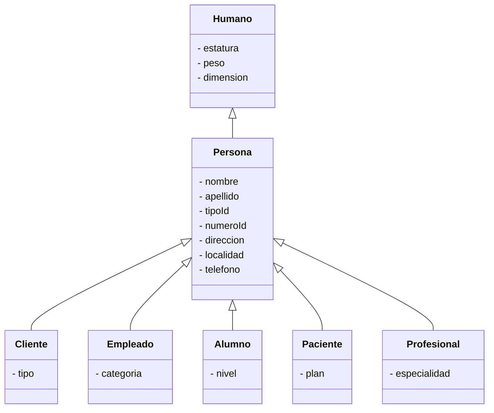
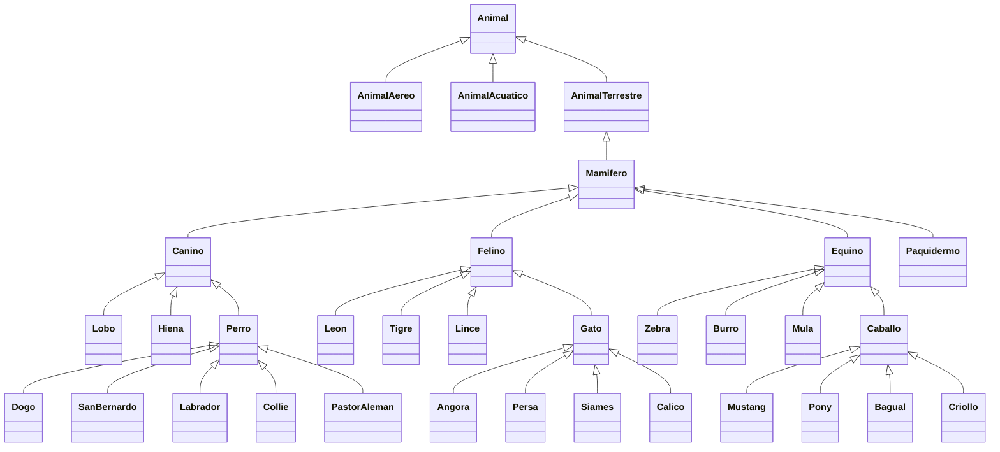

```mermaid
classDiagram
    Humano <|-- Persona
    Persona <|-- Cliente
    Persona <|-- Empleado
    Persona <|-- Alumno
    Persona <|-- Paciente
    Persona <|-- Profesional

    class Humano{
        - estatura
        - peso
        - dimension
    }
    class Persona{
        - nombre
        - apellido
        - tipoId
        - numeroId
        - direccion
        - localidad
        - telefono
    }
    class Cliente{
        - tipo
    }
    class Empleado{
        - categoria
    }
    class Paciente{
        - plan
    }
    class Alumno{
        - nivel
    }
    class Profesional{
        - especialidad
    }
```

```mermaid
classDiagram
    Animal <|-- AnimalAereo
    Animal <|-- AnimalAcuatico
    Animal <|-- AnimalTerrestre

    AnimalTerrestre <|-- Mamifero
    Mamifero <|-- Canino
    Mamifero <|-- Felino
    Mamifero <|-- Equino
    Mamifero <|-- Paquidermo

    Canino <|-- Lobo
    Canino <|-- Hiena
    Canino <|-- Perro
    Perro <|-- Dogo
    Perro <|-- SanBernardo
    Perro <|-- Labrador
    Perro <|-- Collie
    Perro <|-- PastorAleman

    Felino <|-- Leon
    Felino <|-- Tigre
    Felino <|-- Lince
    Felino <|-- Gato
    
    Gato <|-- Angora
    Gato <|-- Persa
    Gato <|-- Siames
    Gato <|-- Calico

    Equino <|-- Zebra
    Equino <|-- Burro
    Equino <|-- Mula
    Equino <|-- Caballo

    Caballo <|-- Mustang
    Caballo <|-- Pony
    Caballo <|-- Bagual
    Caballo <|-- Criollo
```