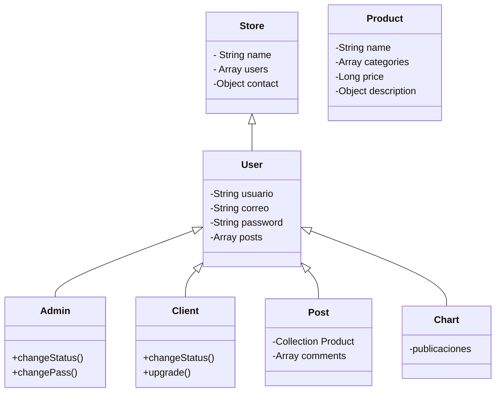

```mermaid

classDiagram
    Store <|-- User
    User <|-- Admin
    User <|-- Client
    User <|-- Post
    User <|-- Chart
    
    class Store
    Store: - String name
    Store: - Array users
    Store: -Object contact

    class User
    User: -String usuario
    User: -String correo
    User: -String password
    User: -Array posts
    
    class Admin
    Admin: +changeStatus()
    Admin: +changePass()
    
    class Client
    Client: +changeStatus()
    Client: +upgrade()
    
    class Post
    Post: -Collection Product
    Post: -Array comments
    
    class Product
    Product: -String name
    Product: -Array categories
    Product: -Long price
    Product: -Object description
    
    class Chart
    Chart: -publicaciones
```