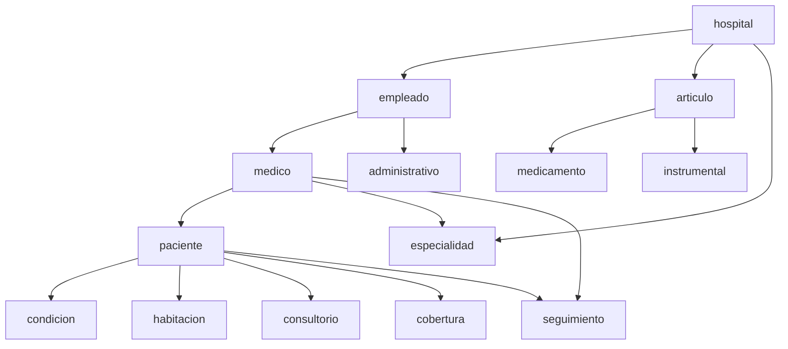

## Clases Sistema de Hospital

```mermaid
graph TD;
hospital-->empleado;
hospital-->articulo;
hospital-->especialidad;
empleado-->medico;
empleado-->administrativo;
medico-->paciente;
medico-->especialidad;
medico-->seguimiento
paciente-->condicion;
paciente-->habitacion;
paciente-->consultorio;
paciente-->cobertura;
paciente-->seguimiento
articulo-->medicamento;
articulo-->instrumental;
```