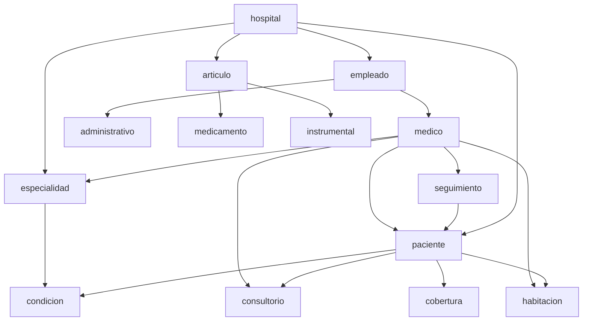

## Clases Sistema de Hospital

```mermaid
graph TD;
hospital-->paciente
paciente-->condicion;
paciente-->habitacion;
paciente-->consultorio;
paciente-->cobertura;
hospital-->empleado;
empleado-->medico;
medico-->seguimiento;
seguimiento-->paciente;
medico-->paciente;
medico-->especialidad;
medico-->consultorio;
medico-->habitacion;
empleado-->administrativo;
hospital-->articulo;
articulo-->medicamento;
articulo-->instrumental;
hospital-->especialidad;
especialidad-->condicion;
```