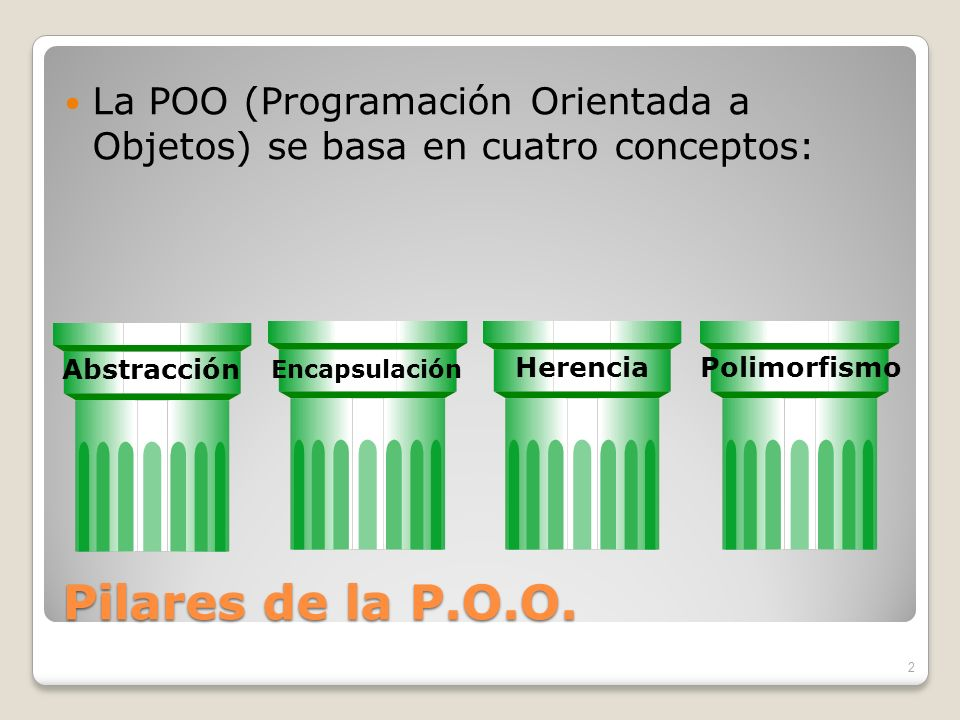

# Introduccion al Paradigma de Objetos

Esto es una guia para los alumnos del curso de __programacion orientada a objetos__ que cursan los dias _lunes miercoles y viernes de 9:30hs a 12:30hs_ donde prodran revisar los contenidos vistos en clase.

## ¿Que es un paradigma?

Cuando utilizamos este terminos nos referimos a un modelo de soluciones probadas, que deberiamos utilizar al llevar a cabo determinadas practicas.

En la programacion orientada a objetos, el enfoque consiste en identificar los diferentes elementos que componen un sistema, como si se tratase de objetos de la vida real.

```
let Persona = {
    nombre: "Cristian",
    apellido: "Racedo",
    edad: 32
}
```


* __OBJETO__: Entidad compuesta por atributos clave, valores y metodos que representa uno de los elementos a utilizar.
* __PROPIEDADES__: Atributos que podemos identificar del objeto a las que les corresponden diferentes valores.
* __METODOS__: funciones que puede llevar a cabo o ejecutar determinado objeto.

## Pilares de la programacion orientada a Objetos


* __Abstraccion__ Capacidad de separar las caracteristicas principales del objeto para la creacion de un molde
* __Encapsulacion__ Capacidad de encerrar las caracteristicas para que solo sean accesibles mediante metodos
* __Herencia__ Capacidad de transmitir todas las propiedades y metodos a futuras instancias.
* __Polimorfismo__ Capacidad de adaptarse a las diferentes necesidades presentadas