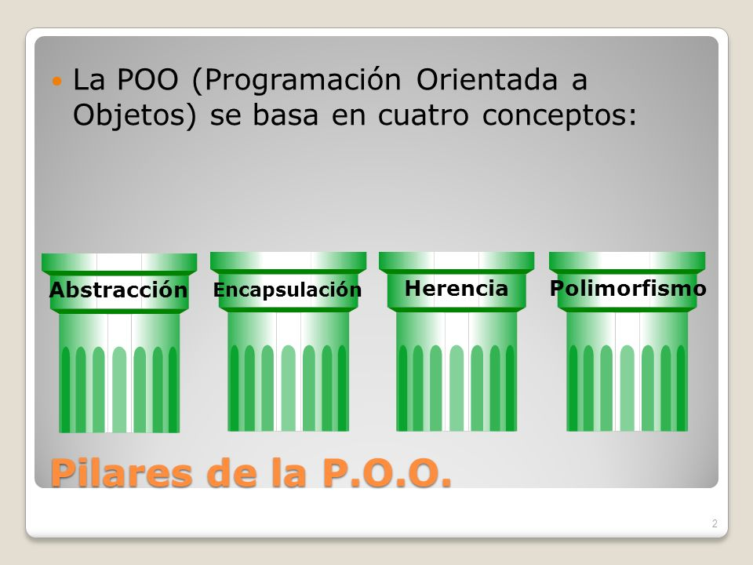

# Introduccion al Paradigma de Objetos

Esta es una guia para los alumnos de la capacitacion de __programacion orientada a objetos__ que cursan los dias _lunes, miercoles y viernes de 14hs a 15hs_ donde podran revisar los contenidos vistos en clase.

## Paradigma

Modelo o patron que define un conjunto de practicas establecidas para la resolucion de conflictos o satisfaccion de ciertas necesidades.

En la programacion orientada a objetos, el enfoque consiste en identificar cada una de las partes que componen un sistema. A estas partes de las reconoce como entidades (objetos) y las mismas poseen diferentes caracteres y funcionalidades.

```
Persona = {
    nombre: "Cristian",
    apellido: "Racedo",
    edad: 32
}
```

## OOP (Object Oriented Programming)

Los objetos son, generalmente, elementos que representan alguna entidad de la vida real. Se caracterizan por tener caracteristicas que los describen y cumplir determinadas funciones en nuestro programa.

* __class__: Palabra clave utilizada para definir como deben crearse los objetos a utilizar
* __Objeto__: Instancia de una clase, consiste en un elemento creado a partir de un molde o plantilla.
* __Propiedades__: Atributos o caracteristicas clave del objeto, a las cuales les corresponde un valor.
* __Metodos__: Acciones o funciones propias del objeto, que pueden ser invocadas en caso de ser necesario.

### Caracteristicas



* __Abstraccion__: Capacidad para distinguir las caracteristicas principales de cada elemento a utilizar.
* __Encapsulamiento__: Capacidad para aislar las caracteristicas de los diferentes objetos.
* __Herencia__: Capacidad de transmitir sus caracteristicas a otras instancias o clases.
* __Polimorfismo__: Capacadidad de adaptar las caracteristicas y funcionalidades segun sea necesario.

## Metodos Predeterminados

* __constructor__ Inicilializa la clase, permitiendo definir los valores iniciales de las propiedades. Normalmente se llama igual que la clase.
* __destructor__ Metodo implementado para liberar espacio en memoria, al igual que el contructor recibe el nombre la clase pero con un _~_ al comienzo
* __setters__ Funciones que se utilizan para definir alguno de los valores de las propiedades del objeto.
* __getters__ Funciones que se utilizan para obtener alguno de los valores de las propiedades del objeto.